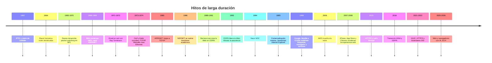

# Historia cronológica de Internet y la World Wide Web

## Resumen ejecutivo

Internet y la Web no son sinónimos. Internet es la infraestructura global de redes interoperables, basada en protocolos abiertos como IP, TCP, DNS y SMTP. La World Wide Web es una aplicación construida encima de esa infraestructura, definida por URL, HTTP y HTML. La confusión entre ambas es comprensible, pero técnicamente es incorrecta: el correo electrónico, el DNS y otros servicios de Internet existían antes de la Web, y siguen funcionando aunque la Web no lo haga. citeturn22search5turn8search10turn23search13

La historia larga tiene cuatro motores. Primero, visión pública y académica, con J.C.R. Licklider, Bob Taylor, Larry Roberts, Paul Baran y Donald Davies empujando la idea de redes resilientes y conmutación de paquetes. Segundo, estandarización abierta, con Vint Cerf, Bob Kahn, Jon Postel, Paul Mockapetris, la IETF, la IANA y después la ICANN coordinando protocolos, identificadores y evolución técnica. Tercero, universalización de la Web, con Tim Berners-Lee, Robert Cailliau, CERN y luego W3C manteniendo la Web como plataforma abierta y sin regalías. Cuarto, escala industrial, con NSF, universidades, ISPs y compañías como AT&T, IBM, Microsoft, Google, Cisco, AWS y Cloudflare convirtiendo la red en infraestructura económica y social planetaria. citeturn24search1turn38search3turn38search4turn24search6turn8search4turn36search7turn23search13turn23search5turn39search17turn26search0turn33search2turn32search0turn15search2

La razón de fondo por la cual Internet y la Web sobrevivieron a rivales propietarios no fue magia, fue arquitectura y gobernanza. Internet separó capas técnicas y permitió interconectar redes heterogéneas. La Web, a su vez, se volvió ubicua porque CERN la liberó al dominio público y W3C la mantuvo interoperable. Cada vez que una capa intentó cerrarse, navegadores, estándares y software libre reabrieron el sistema. La lucha no terminó: hoy el conflicto central ya no es “si Internet existirá”, sino quién intermedia, inspecciona, monetiza o regula el tráfico, la identidad, el descubrimiento y ahora también la interfaz con IA. citeturn22search5turn8search4turn36search12turn28search0turn17search0turn17search13turn21search7

## Internet y Web, y los padres que realmente la moldearon

La forma más limpia de entender esta historia es separar tres planos. El plano de transporte y enrutamiento, donde nacen la conmutación de paquetes, TCP/IP, DNS y SMTP. El plano de documentos y aplicaciones, donde aparecen HTTP, HTML, navegadores y motores de búsqueda. Y el plano de coordinación institucional, donde IETF, IANA, ICANN, W3C, DARPA, NSF, CERN y la comunidad operadora convierten inventos en sistema estable. Ese tercer plano suele ignorarse, y es un error clásico: sin gobernanza técnica, el invento se queda en demo; sin operación industrial, se queda en paper. citeturn23search13turn23search5turn39search17turn36search12turn24search1turn26search0

| Figura                     | Papel troncal                           | Aporte histórico decisivo                                                                                                                                                                 |
| -------------------------- | --------------------------------------- | ----------------------------------------------------------------------------------------------------------------------------------------------------------------------------------------- |
| J.C.R. Licklider           | Visionario y primer gran patrocinador   | Impulsó desde ARPA/IPTO la idea de cómputo interactivo y de una red de recursos compartidos, la intuición más cercana al “Internet antes de Internet”. citeturn24search1turn25search1 |
| Paul Baran                 | Arquitecto conceptual de resiliencia    | Formalizó en RAND la lógica de redes distribuidas y tolerantes a fallas, pieza seminal para pensar comunicaciones robustas. citeturn38search3                                          |
| Donald Davies              | Coinventor práctico de packet switching | En NPL desarrolló el concepto y la implementación temprana de packet switching, base operativa de la red moderna. citeturn38search4turn38search7                                      |
| Bob Taylor y Larry Roberts | Constructores de ARPANET                | Tradujeron la visión en programa y arquitectura de red real dentro de ARPA. citeturn24search2turn25search8                                                                            |
| Vint Cerf y Bob Kahn       | Padres de Internet                      | Diseñaron la lógica de internetworking y TCP/IP, permitiendo unir redes distintas bajo una arquitectura abierta. citeturn24search6turn22search5                                       |
| Jon Postel                 | Editor y guardián técnico               | Central en RFCs, asignación de números, correo y operación temprana de la red; fue bisagra entre diseño y gobernanza. citeturn23search5turn41search0turn38search2                    |
| Paul Mockapetris           | Padre de DNS                            | Diseñó el sistema de nombres que hizo escalable Internet más allá de tablas manuales de hosts. citeturn6search2turn6search7turn38search2                                             |
| Tim Berners-Lee            | Padre de la Web                         | Integró URL, HTTP, HTML, navegador y servidor en una plataforma documental universal sobre Internet. citeturn8search4turn8search6turn36search7                                       |
| Robert Cailliau            | Cofundador operativo de la Web en CERN  | Ayudó a empujar, explicar y organizar el proyecto WWW dentro de CERN y su expansión temprana. citeturn37image7turn8search0                                                            |
| Bob Metcalfe y David Boggs | Padres de Ethernet                      | Hicieron de la LAN una realidad industrial; su trabajo terminó siendo parte del “plomerío” físico de Internet. citeturn27search0turn27search10turn27search19                         |

La línea de tiempo de compresión cabe en un diagrama, aunque la historia real sea bastante más sucia, política y llena de accidentes felices. citeturn24search1turn24search6turn26search0turn8search4turn36search7turn39search17turn19search1turn21search7

## Cronología fundacional

La fase fundacional no fue una sola invención, fue una cadena de desacoples. Primero se desacopló el cómputo del hardware exclusivo, con time-sharing. Luego se desacopló la comunicación del circuito fijo, con packet switching. Después se desacoplaron las redes entre sí, con internetworking. Y al final se desacopló el contenido del host específico, con nombres, correo estandarizado y protocolos abiertos. Ahí nació Internet de verdad. citeturn24search1turn38search3turn38search4turn24search6turn23search13

Estas imágenes oficiales muestran el paso de idea a infraestructura: el esquema inicial de ARPANET, el registro del primer mensaje, la interfaz temprana del navegador WorldWideWeb y el papel de CERN como gran hub europeo cuando la Web estaba naciendo. Sí, la historia de Internet también tiene garabatos de servilleta, como toda tecnología que luego presume inevitabilidad. citeturn24search2turn8search4turn37image3

iturn37image0turn37image10turn37image1turn37image3

| Fecha                     | Evento                           | Descripción concisa                                                                                                                         | Personas clave y rol                                                                            | Instituciones y empresas                    | Impacto técnico o social                                                                               | Fuentes primarias                                                                              |
| ------------------------- | -------------------------------- | ------------------------------------------------------------------------------------------------------------------------------------------- | ----------------------------------------------------------------------------------------------- | ------------------------------------------- | ------------------------------------------------------------------------------------------------------ | ---------------------------------------------------------------------------------------------- |
| 1960-1962                 | Visión de red interactiva e IPTO | Licklider empuja en ARPA la idea de cómputo interactivo y recursos compartidos en red; IPTO nace como brazo institucional para financiarlo. | J.C.R. Licklider, director y visionario; Bob Taylor, continuador programático.                  | ARPA/DARPA, MIT, universidades financiadas. | Cambia la meta: no “una máquina más grande”, sino una red de máquinas cooperando.                      | DARPA IPTO; CHM historia de los sesenta. citeturn24search1turn25search1                    |
| 1962-1964                 | Redes distribuidas de Baran      | RAND publica la serie _On Distributed Communications_, que formaliza redes distribuidas y tolerantes a fallas.                              | Paul Baran, investigador de RAND.                                                               | RAND, USAF Project RAND.                    | Base conceptual de resiliencia y enrutamiento distribuido.                                             | RAND RM-3420 y archivo RAND. citeturn38search3                                              |
| 1965-1970                 | Packet switching en NPL          | Donald Davies y su equipo desarrollan packet switching y redes prácticas en NPL.                                                            | Donald Davies, coinventor; equipo de NPL.                                                       | National Physical Laboratory.               | Convierte una intuición teórica en un método de transmisión reusable y escalable.                      | NPL biografía e historial. citeturn38search4turn38search7                                  |
| 1968, día no especificado | Contrato IMP para ARPANET        | ARPA contrata a BBN para construir los primeros routers, los Interface Message Processors.                                                  | Larry Roberts, director técnico; Bob Taylor, impulsor; equipo de BBN.                           | ARPA, BBN.                                  | Nace la posibilidad de una red operativa de paquetes entre hosts heterogéneos.                         | DARPA ARPANET; registro visual histórico. citeturn24search2turn37image11                   |
| 1969, finales de año      | Primeros cuatro nodos de ARPANET | Quedan enlazados UCLA, SRI, UCSB y Utah; el 29 de octubre se registra el primer intento de mensaje entre UCLA y SRI.                        | Equipos de UCLA y SRI; Charley Kline en UCLA; liderazgo previo de Roberts y Taylor.             | ARPA, UCLA, SRI, UCSB, Utah, BBN.           | Pasa de proyecto a red viva. El “network of computers” deja de ser aspiración.                         | DARPA; CHM. citeturn24search0turn25search5                                                 |
| 1971-1972                 | Email en red                     | Ray Tomlinson adapta programas existentes para enviar correo entre hosts y adopta la convención `usuario@host`.                             | Ray Tomlinson, creador del email en red.                                                        | BBN, ARPANET.                               | El correo se vuelve la primera “killer app” de Internet.                                               | RFC Hobbes timeline; CHM. citeturn40search1turn40search6turn40search12                    |
| 1973-1974                 | Internetworking y Ethernet       | Kahn y Cerf trabajan en protocolos para unir redes distintas; al mismo tiempo, Metcalfe y Boggs crean Ethernet en Xerox PARC.               | Bob Kahn, arquitecto; Vint Cerf, coautor; Bob Metcalfe y David Boggs, coinventores de Ethernet. | DARPA, Stanford, Xerox PARC.                | Dos capas quedan resueltas: interred y red local. Eso ya parece Internet, no accidente de laboratorio. | DARPA TCP/IP; IEEE/CHM sobre Ethernet. citeturn24search6turn27search0turn27search10       |
| 1981-1983                 | Se formaliza la pila básica      | RFC 791 define IP, RFC 793 define TCP y RFC 821 consolida SMTP; en 1983 ARPANET migra a TCP/IP.                                             | Jon Postel, editor y autor clave; Cerf y Kahn como padres de marco; comunidad RFC.              | IETF/RFC Editor, DARPA, USC/ISI.            | La red deja de depender de acuerdos ad hoc y pasa a operar sobre estándares replicables.               | RFC 791, RFC 793, RFC 821, DARPA. citeturn6search0turn6search1turn41search0turn24search0 |

La lectura correcta de esta fase es brutalmente simple: Internet no nació por una sola idea brillante, nació porque varias personas resolvieron problemas distintos y compatibles. Licklider imaginó, Baran y Davies hicieron pensable el medio, Roberts y BBN lo operaron, Tomlinson le dio utilidad humana, y Cerf-Kahn lo volvieron sistema general. Sin esa cadena, la Web jamás habría tenido dónde vivir. citeturn24search1turn38search3turn38search4turn40search6turn24search6

## Cronología de apertura y comercialización

Aquí ocurre el gran giro. Internet deja de ser red de investigación relativamente pequeña y se convierte en infraestructura nacional e internacional. Luego, casi sin pedir permiso, se le monta encima la Web, que simplifica la publicación y el descubrimiento de información de una forma salvajemente superior a la mayoría de sus contemporáneos. La decisión de CERN de liberar la Web sin regalías fue el punto de no retorno. citeturn26search0turn8search4turn36search7

| Fecha                     | Evento                                              | Descripción concisa                                                                                                                                      | Personas clave y rol                                                                                                        | Instituciones y empresas                       | Impacto técnico o social                                                                                            | Fuentes primarias                                                                                               |
| ------------------------- | --------------------------------------------------- | -------------------------------------------------------------------------------------------------------------------------------------------------------- | --------------------------------------------------------------------------------------------------------------------------- | ---------------------------------------------- | ------------------------------------------------------------------------------------------------------------------- | --------------------------------------------------------------------------------------------------------------- |
| 1983-1987                 | DNS hace escalable la red                           | Se abandona la tabla plana de hosts y se consolida el Domain Name System; aparecen TLDs como `.com`, `.org`, `.edu`, `.gov` y `.mil`.                    | Paul Mockapetris, diseñador; Jon Postel, coordinación; Craig Partridge, colaboración temprana.                              | USC/ISI, BBN, IANA.                            | Internet deja de romperse por crecimiento administrativo. Nombrar ya no es una pesadilla manual.                    | RFC 1034/1035; CHM. citeturn6search2turn6search7turn38search2                                              |
| 1986, día no especificado | Nace NSFNET                                         | NSF lanza NSFNET para conectar investigadores y centros de supercómputo; se vuelve backbone académico de facto en EE.UU.                                 | Equipos de NSF, universidades y socios industriales.                                                                        | NSF, universidades, IBM y socios del backbone. | Democratiza el acceso académico y prepara la futura privatización comercial.                                        | NSF Impacts; IBM NSFNET. citeturn26search0turn35search5                                                     |
| 1989-1990                 | Propuesta WWW en CERN                               | Berners-Lee propone un sistema distribuido de información y, en 1990, ya existen servidor, navegador/editor y los principios de URL, HTTP y HTML.        | Tim Berners-Lee, inventor; Robert Cailliau, coproponente y promotor interno.                                                | CERN.                                          | La Web nace como capa documental universal sobre Internet.                                                          | CERN historia del Web; WorldWideWeb history. citeturn8search0turn8search4turn37image7                      |
| 1991, día no especificado | Primer sitio web                                    | `info.cern.ch` entra en servicio como punto público del proyecto World Wide Web.                                                                         | Tim Berners-Lee; equipo de CERN.                                                                                            | CERN.                                          | La Web pasa de idea interna a servicio visible.                                                                     | CERN historia del Web. citeturn8search4                                                                      |
| 30 abril 1993             | CERN libera la Web                                  | CERN pone el software WWW en dominio público.                                                                                                            | Tim Berners-Lee; CERN como titular institucional.                                                                           | CERN.                                          | La apertura jurídica acelera adopción global y evita captura propietaria temprana.                                  | CERN Birth of the Web. citeturn8search4                                                                      |
| 1993, día no especificado | Mosaic populariza la Web                            | NCSA Mosaic ofrece navegador usable para Unix, Mac y PC, y vuelve la Web instalable por no expertos.                                                     | Marc Andreessen, cocreador; Eric Bina, cocreador.                                                                           | NCSA, University of Illinois.                  | La Web pasa de herramienta académica a fenómeno masivo.                                                             | NCSA y CHM. citeturn9search0turn9search4turn25search4                                                      |
| octubre 1994              | Nace W3C                                            | Berners-Lee funda W3C en MIT en colaboración con CERN y apoyo de DARPA y la Comisión Europea.                                                            | Tim Berners-Lee, fundador.                                                                                                  | W3C, MIT, CERN, DARPA, Comisión Europea.       | La Web gana una casa institucional para estándares abiertos.                                                        | W3C history/about. citeturn36search7turn36search12                                                          |
| 1995, día no especificado | Comercialización abierta y guerra de navegadores    | NSF cierra NSFNET como backbone; Netscape expande el navegador comercial; JavaScript nace en Netscape; Microsoft lanza Internet Explorer con Windows 95. | Brendan Eich, creador de JavaScript; Marc Andreessen y Jim Clark, Netscape; Bill Gates y equipo IE, respuesta de Microsoft. | NSF, Netscape, Microsoft.                      | Internet entra al mercado de masas y empieza la lucha por controlar la puerta de entrada a la Web.                  | NSF GPRA/Impacts; MDN; Microsoft. citeturn26search4turn26search0turn29search1turn10search0turn10search16 |
| 1998, día no especificado | Búsqueda, navegador abierto y gobernanza de nombres | Google incorpora PageRank al descubrimiento web; Netscape libera código y nace Mozilla; ICANN se crea para coordinar DNS e identificadores.              | Larry Page y Sergey Brin, fundadores; comunidad Mozilla; Jon Postel y comunidad de gobernanza técnica en transición.        | Google, Mozilla, ICANN, IANA, Stanford.        | La Web se hace encontrable, el navegador vuelve a ser disputable y el DNS entra a un régimen multiactor más formal. | Stanford PageRank; Mozilla history; ICANN history. citeturn30search4turn28search0turn39search17            |
| 1998-1999                 | Antitrust y fin de la primera guerra de navegadores | La integración agresiva de IE en Windows escala a litigio antimonopolio.                                                                                 | Departamento de Justicia de EE.UU.; Microsoft; Netscape como contraparte de mercado.                                        | DOJ, Microsoft.                                | Queda claro que el navegador ya no es accesorio, es infraestructura estratégica.                                    | DOJ y Microsoft history. citeturn7search8turn10search2turn10search18                                       |

Si se quiere una conclusión incómoda de esta etapa, aquí va: la Web ganó porque era abierta, pero también porque fue rápidamente colonizada por actores comerciales brutalmente eficaces. W3C evitó el colapso de interoperabilidad total; el mercado, en cambio, empujó velocidad, distribución y escala. Sin ambos, la Web habría sido o un bonito experimento europeo, o un centro comercial roto. citeturn36search12turn36search7turn10search0turn28search0turn32search0

## Cronología de plataformas, movilidad y nube

Entre 2000 y 2015 la Web deja de ser “páginas” y se convierte en plataforma. Lo decisivo no es una sola tecnología, sino la convergencia entre plataformas sociales, computación en nube, teléfonos inteligentes, navegadores más capaces y cifrado automatizado. El cliché de “Web 2.0” ocultó algo más importante: el poder se desplazó de la página al servicio, y del documento al flujo de datos y aplicaciones. citeturn12search2turn12search3turn13search0turn12search0turn11search2

| Fecha                     | Evento                                       | Descripción concisa                                                                                                                                        | Personas clave y rol                                                                                        | Instituciones y empresas                       | Impacto técnico o social                                                                                                                                                             | Fuentes primarias                                                                         |
| ------------------------- | -------------------------------------------- | ---------------------------------------------------------------------------------------------------------------------------------------------------------- | ----------------------------------------------------------------------------------------------------------- | ---------------------------------------------- | ------------------------------------------------------------------------------------------------------------------------------------------------------------------------------------ | ----------------------------------------------------------------------------------------- |
| 2004-2005                 | Web social y contenido generado por usuarios | Facebook se lanza en 2004 y YouTube registra su dominio en 2005 con la ambición de publicar video para cualquiera con cámara e Internet.                   | Mark Zuckerberg y equipo fundador; Chad Hurley y equipo fundador de YouTube.                                | Facebook/Meta, YouTube.                        | La Web deja de ser principalmente lectura y se vuelve identidad, comunidad, video y publicación masiva.                                                                              | Meta about; YouTube official blog. citeturn12search2turn12search3                     |
| 2005, día no especificado | DNSSEC                                       | La IETF publica el conjunto base de DNSSEC para autenticidad de origen e integridad de datos DNS.                                                          | Comunidad IETF; autores Arends y colegas.                                                                   | IETF, IANA, operadores DNS.                    | El sistema de nombres deja de ser sólo resoluble y empieza a ser verificable.                                                                                                        | RFC 4033/4034. citeturn18search1turn20search5                                         |
| marzo 2006                | La nube pública despega                      | AWS lanza S3 y luego EC2, convirtiendo infraestructura en servicio escalable sobre la red.                                                                 | Equipos de Amazon/AWS.                                                                                      | AWS.                                           | El backend de Internet se externaliza: desplegar servicios ya no exige poseer un datacenter.                                                                                         | AWS origins y whitepaper. citeturn13search0turn13search17                             |
| junio 2007-julio 2008     | iPhone y App Store                           | Apple presenta iPhone y al año siguiente abre App Store con 500 apps en el lanzamiento.                                                                    | Steve Jobs y equipos Apple/iOS.                                                                             | Apple, AT&T.                                   | La experiencia de Internet se vuelve móvil, táctil y distribuida por tiendas de apps, alterando el balance Web vs apps nativas.                                                      | Apple Newsroom. citeturn12search0turn12search1turn12search17                         |
| septiembre 2008           | Chrome y Chromium                            | Google lanza Chrome y, al mismo tiempo, abre Chromium como proyecto libre.                                                                                 | Larry Page, Sergey Brin y equipo Chromium; Parisa Tabriz y sucesores en seguridad luego continúan la línea. | Google, Chromium.                              | Reinicia la competencia en navegadores con foco en velocidad, sandboxing y actualizaciones rápidas.                                                                                  | Chromium blog y Google. citeturn11search2turn11search8                                |
| 2008-2015                 | Surgen corrientes cripto y Web3              | Bitcoin presenta un modelo monetario y de consenso descentralizado; Ethereum publica su whitepaper en 2014 y se lanza en 2015 como plataforma programable. | Satoshi Nakamoto, autor del whitepaper de Bitcoin; Vitalik Buterin, autor del whitepaper de Ethereum.       | Bitcoin, Ethereum Foundation/comunidad.        | Abre una línea paralela: identidad, activos y ejecución sin autoridad central. En la práctica, no reemplaza la Web, pero sí reabre la discusión sobre confianza y propiedad digital. | Bitcoin.org; Ethereum whitepaper/portal. citeturn21search0turn21search1turn21search5 |
| septiembre 2010-2015      | La “edge web” gana peso                      | Cloudflare se lanza en 2010, posicionando seguridad, CDN y rendimiento como capa intermedia crítica.                                                       | Matthew Prince, Michelle Zatlyn y Lee Holloway, fundadores.                                                 | Cloudflare.                                    | El borde de la red gana poder operativo y político: caché, mitigación DDoS, DNS y terminación TLS se concentran en operadores globales.                                              | Cloudflare our story y founders’ letter. citeturn15search2turn15search15              |
| mayo-diciembre 2015       | HTTP/2 y Let’s Encrypt                       | HTTP/2 optimiza multiplexación y latencia; Let’s Encrypt entra en beta pública y automatiza certificados gratuitos.                                        | Comunidad IETF; Josh Aas y equipo ISRG/Let’s Encrypt.                                                       | IETF, ISRG/Let’s Encrypt, navegadores y hosts. | Rendimiento y cifrado pasan de “extra” a expectativa básica.                                                                                                                         | RFC 7540; Let’s Encrypt blog. citeturn19search0turn14search6turn14search2            |

La trampa intelectual de esta etapa es pensar que “la Web murió y las apps ganaron”. No exacto. Lo que pasó fue peor y mejor a la vez. La Web perdió centralidad en UX móvil cerrada, pero ganó como sustrato de distribución, APIs, video, anuncios, autenticación, nube y tiempo real. En otras palabras, dejó de verse y empezó a estar en todas partes. citeturn12search0turn12search1turn13search0turn15search2turn19search0

## Cronología contemporánea

Desde 2016 la historia gira alrededor de cuatro tensiones: gobernanza global, privacidad y cifrado por defecto, concentración en grandes plataformas y nubes, y la entrada de IA como nueva interfaz de descubrimiento y navegación. También aparece el ruído de “Web3”, que sí dejó huella, aunque mucho menos en el stack dominante de lo que evangelistas y detractores suelen admitir. citeturn39search17turn17search0turn13search2turn21search6turn21search7

| Fecha           | Evento                                               | Descripción concisa                                                                                                                                       | Personas clave y rol                                                                   | Instituciones y empresas                   | Impacto técnico o social                                                                                                                                                                    | Fuentes primarias                                                                                    |
| --------------- | ---------------------------------------------------- | --------------------------------------------------------------------------------------------------------------------------------------------------------- | -------------------------------------------------------------------------------------- | ------------------------------------------ | ------------------------------------------------------------------------------------------------------------------------------------------------------------------------------------------- | ---------------------------------------------------------------------------------------------------- |
| octubre 2016    | Transición de custodia de IANA                       | Se completa la transición de stewardship de IANA, alejando la supervisión directa del gobierno de EE.UU. hacia el modelo multiactor.                      | Comunidad técnica global; ICANN; operadores y cuerpos de coordinación.                 | ICANN, IANA, comunidad de Internet.        | La gobernanza de identificadores gana legitimidad internacional, aunque no desaparecen las disputas políticas.                                                                              | ICANN History Project. citeturn39search17turn39search1                                           |
| abril-mayo 2016 | GDPR                                                 | La Unión Europea adopta el Reglamento (UE) 2016/679.                                                                                                      | Legisladores e instituciones de la UE; autoridades de protección de datos.             | UE, EUR-Lex.                               | La privacidad pasa de “política de sitio” a obligación regulatoria estructural con efectos globales.                                                                                        | EUR-Lex en español. citeturn17search0turn17search4                                               |
| 2017-2018       | Neutralidad de red y nueva ola de privacidad técnica | FCC desmonta la política de neutralidad en 2017; en 2018 llegan TLS 1.3, DNS over HTTPS y 1.1.1.1 de Cloudflare.                                          | FCC; Eric Rescorla, autores TLS 1.3; Hoffman y McManus, DoH; equipos Cloudflare/APNIC. | FCC, IETF, Cloudflare, APNIC.              | El debate regulatorio se cruza con protección criptográfica y privacidad operacional del usuario.                                                                                           | FCC; RFC 8446; RFC 8484; Cloudflare. citeturn17search14turn13search2turn20search0turn14search5 |
| 2021-2022       | QUIC y HTTP/3                                        | QUIC se estandariza en 2021 y HTTP/3 en 2022 como mapeo de HTTP sobre QUIC.                                                                               | Comunidad IETF; Iyengar, Thomson y coautores; operadores y navegadores que despliegan. | IETF, navegadores, CDNs, nubes.            | Menor latencia, mejor multiplexación y cifrado integrado más cerca del transporte real de la Web.                                                                                           | RFC 9000 y RFC 9114. citeturn18search3turn19search1                                              |
| julio 2022      | W3C estandariza DIDs                                 | W3C publica DIDs como estándar web oficial.                                                                                                               | Comunidad W3C del grupo DID.                                                           | W3C.                                       | Reconoce formalmente una pieza de identidad descentralizada dentro del ecosistema web, aunque su adopción práctica siga fragmentada.                                                        | W3C press release y spec. citeturn21search6turn21search10                                        |
| 2023            | W3C cambia de forma y HTTPS se vuelve “lo normal”    | W3C se relanza como nonprofit de interés público; EFF retira HTTPS Everywhere porque los navegadores ya incorporan HTTPS por defecto.                     | Equipo W3C; EFF; fabricantes de navegadores.                                           | W3C, EFF, navegadores.                     | El estándar web se institucionaliza mejor y el cifrado pasa de recomendación a expectativa basal.                                                                                           | W3C; EFF. citeturn36search6turn14search13                                                        |
| 2024            | Nuevo ciclo regulatorio                              | FCC vota restaurar la neutralidad de red; en Europa, leyes como DMA y DSA consolidan una era de supervisión a gatekeepers y plataformas.                  | FCC; instituciones de la UE.                                                           | FCC, Unión Europea.                        | La capa jurídica intenta recuperar poder frente a plataformas que ganaron demasiado tamaño.                                                                                                 | FCC; EUR-Lex. citeturn17search13turn16search5turn16search8                                      |
| 2025-2026       | Web y navegadores con IA y privacidad más profunda   | Google integra IA en Search y Chrome; en 2026 RFC 9849 formaliza Encrypted Client Hello y RFC 9953 lleva DNS cifrado a dispositivos restringidos vía DoC. | Equipos de Google; autores IETF; operadores y navegadores.                             | Google, IETF, navegadores, ecosistema IoT. | La interfaz de acceso a la Web se vuelve conversacional y el cifrado oculta cada vez más metadatos. El nuevo cuello de botella ya no es sólo ancho de banda, es intermediación algorítmica. | Google blogs; RFC 9849; RFC 9953. citeturn21search7turn21search15turn13search20turn20search16  |

La foto presente es menos romántica que la fundacional. La Internet abierta sigue existiendo, pero corre sobre una infraestructura cada vez más concentrada en pocas nubes, pocos operadores de borde, pocos navegadores y pocos índices de búsqueda. La novedad de 2025-2026 no es que la Web “se vuelva IA”; es que la capa de descubrimiento y mediación humana empieza a separarse del navegador clásico, y eso puede redefinir tráfico, SEO, publicidad, privacidad y poder de plataforma. citeturn13search3turn15search2turn32search3turn21search15turn21search7

## Instituciones y empresas que la siguen moldeando

La tabla siguiente compara actores que no sólo participaron en la historia, sino que siguen importando. No todos hacen lo mismo. Unos financian investigación, otros coordinan números y estándares, otros operan la malla física o lógica, y otros controlan la experiencia de uso. Juntarlos en una sola categoría sería torpe; compararlos ayuda a ver dónde vive el poder real. citeturn24search1turn23search13turn23search5turn36search12turn15search2

| Institución o empresa | Año de fundación | Rol histórico                                   | Contribuciones mayores                                                                                                                                                                 | Estado actual                                                                                                                                                      |
| --------------------- | ---------------: | ----------------------------------------------- | -------------------------------------------------------------------------------------------------------------------------------------------------------------------------------------- | ------------------------------------------------------------------------------------------------------------------------------------------------------------------ |
| DARPA                 |             1958 | Financiamiento público de I+D de alto riesgo    | IPTO, ARPANET, impulso decisivo a TCP/IP e internetworking. citeturn24search1turn24search2turn24search6                                                                           | Sigue como agencia federal de I+D avanzada; Internet ya no es su proyecto central, pero fue uno de sus legados más profundos. citeturn24search16                |
| NSF                   |             1950 | Expansión académica de Internet                 | NSFNET hizo de backbone académico nacional a la Internet temprana y abrió la ruta a la privatización competitiva. citeturn26search0turn26search4                                   | Sigue financiando ciencia e infraestructura de investigación; su papel histórico en Internet ya es legado, no operación directa. citeturn26search0              |
| CERN                  |             1954 | Ecosistema científico europeo y cuna de la Web  | Berners-Lee y Cailliau crean la Web en CERN; además, CERN fue un gran hub europeo de Internet a inicios de los noventa. citeturn8search4turn37image3                               | Continúa como laboratorio científico; la Web quedó como una de sus mayores externalidades civilizatorias. citeturn8search0                                      |
| IETF                  |             1986 | Desarrollo abierto de estándares de Internet    | Produce RFCs y estándares para TCP/IP, DNS, SMTP, TLS, HTTP/2, QUIC, HTTP/3 y mucho más. citeturn23search13turn6search1turn19search1                                              | Sigue siendo el principal foro técnico de estándares de Internet. citeturn23search13turn23search7                                                              |
| IANA                  |   década de 1970 | Coordinación de identificadores únicos          | Puertos, parámetros de protocolo, números y coordinación de zonas raíz. citeturn23search2turn23search11                                                                            | Las funciones IANA hoy las presta PTI, afiliada de ICANN. citeturn23search2turn23search5                                                                       |
| ICANN                 |             1998 | Coordinación de DNS y nombres únicos            | Formalizó la coordinación multiactor del DNS y recibió la transición de stewardship de IANA en 2016. citeturn39search17turn39search1                                               | Sigue como corporación sin fines de lucro global para estabilidad, seguridad e interoperabilidad de identificadores. citeturn22search4turn39search8            |
| W3C                   |             1994 | Estándares de la Web                            | HTML, CSS, accesibilidad, internacionalización, privacidad, seguridad y múltiples APIs del ecosistema web. citeturn36search7turn36search12                                         | Desde 2023 opera como nonprofit de interés público, manteniendo gobernanza global de estándares web. citeturn36search6turn36search15                           |
| NCSA                  |             1986 | Acelerador universitario del Web temprano       | Mosaic, primer navegador ampliamente usable y soportado por una gran institución. citeturn9search0turn9search4                                                                     | Sigue como centro de supercómputo e investigación en la University of Illinois. citeturn9search12                                                               |
| AT&T                  |             1885 | Telecom y backbone/ISP                          | Heredera de la infraestructura telefónica de larga distancia y luego gran operador IP y de acceso, clave para la Internet comercial estadounidense. citeturn31search0turn34search8 | Se define hoy como empresa avanzada de conectividad, con fibra y 5G como foco. citeturn31search8turn34search7                                                  |
| IBM                   |             1911 | Infraestructura empresarial y backbone temprano | Participó en NSFNET con socios tecnológicos; más tarde empujó e-business y middleware del Internet comercial. citeturn35search5turn35search0                                       | Hoy opera como proveedor de nube híbrida, consultoría y AI empresarial. citeturn31search5turn35search18                                                        |
| Microsoft             |             1975 | Plataforma cliente y guerra de navegadores      | Internet Explorer integró la Web al escritorio de masas; después Azure hizo a Microsoft actor principal de la nube. citeturn31search7turn10search0                                 | A 50 años, Microsoft se posiciona sobre nube e IA, manteniendo rol estructural en software e infraestructura. citeturn31search19turn31search15                 |
| Google                |             1998 | Búsqueda, navegador, móvil y publicidad web     | PageRank redefinió descubrimiento; Chrome/Chromium rediseñaron el navegador; Search y Android moldearon la Web móvil. citeturn30search4turn32search0turn11search2                 | Sigue como uno de los actores más influyentes en Search, Chrome, Android y ahora IA aplicada a la navegación. citeturn32search3turn21search7                   |
| Cisco                 |             1984 | Routing e infraestructura de red                | Inventó el router multiprotocolo comercial temprano y ayudó a construir el tejido de internetworking empresarial. citeturn33search2turn33search6                                   | Se presenta hoy como proveedor central de networking y seguridad para la era de IA. citeturn31search6turn33search7                                             |
| AWS                   |             2006 | Nube pública                                    | S3 y EC2 convirtieron la infraestructura en un servicio accesible sobre Internet. citeturn13search0turn13search17                                                                  | Se describe hoy como la nube más amplia y profunda, con fuerte énfasis en AI. citeturn13search3turn13search14                                                  |
| Cloudflare            |             2009 | Borde de red, CDN, DNS y seguridad              | Hizo masiva la capa edge para rendimiento, DDoS, DNS y terminación de tráfico; 1.1.1.1 volvió visible el rol del resolver público. citeturn15search2turn14search5                  | Opera una de las redes más extendidas del borde y se reposiciona también como “connectivity cloud” para apps y agentes de IA. citeturn15search13turn15search15 |

La conclusión histórica dura es esta. Internet fue diseñada para descentralizar fallas, no necesariamente para descentralizar poder económico. Técnicamente aguanta heterogeneidad; institucionalmente depende de cooperación abierta; comercialmente tiende a concentrarse en quien controla búsqueda, navegador, nube, identidad, DNS, acceso o borde. Ese choque explica casi todo lo que hoy llamamos privacidad, neutralidad, soberanía digital, seguridad del DNS, interoperabilidad y “Web con IA”. No es una etapa nueva separada del pasado. Es el pasado repitiéndose, sólo que ahora con más cómputo, más regulación y más intermediarios. citeturn38search3turn22search5turn23search13turn39search17turn17search0turn17search13turn21search7
